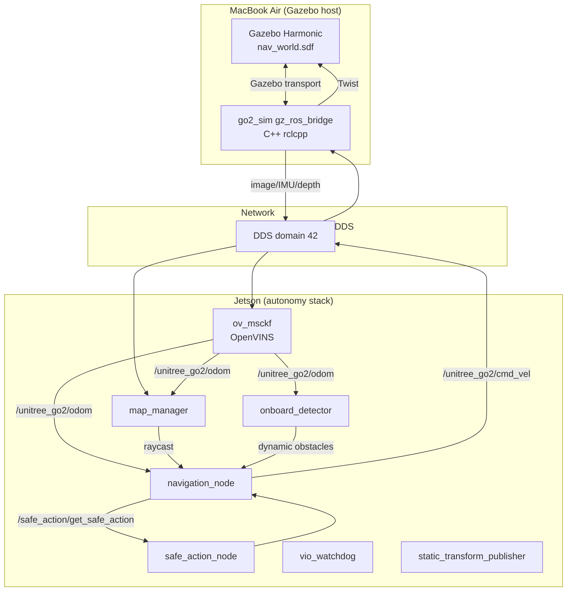
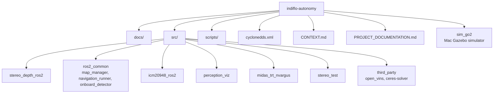

# Project Documentation — Indiflo Stereo VIO + Navigation

## Table of Contents

- [Overview](#overview)
- [Quick Start](#quick-start)
- [System Architecture](#system-architecture)
- [Data Flow](#data-flow)
- [Repositories & Packages](#repositories--packages)
- [Configuration Summary](#configuration-summary)
- [Operating the System](#operating-the-system)
- [Documentation Index](#documentation-index)

## Overview

Autonomous navigation stack for a Unitree Go2-like robot using stereo cameras + IMU visual-inertial odometry (OpenVINS), occupancy mapping, dynamic obstacle detection, and an RL-based navigation policy. The stack runs on an NVIDIA Jetson. A Gazebo Harmonic simulator on macOS can replace the physical sensors for safe development and testing.

## Quick Start

### Hybrid simulation

```bash
# Mac
bash
source /Users/pranav/personal/indiflo/sim/setup_env.sh
ros2 launch go2_sim sim_world.launch.py gui:=false

# Jetson
source /workspaces/ros2_ws/scripts/setup_jetson_sim_env.sh
ros2 launch stereo_depth_ros2 stereo_vio_navigation_sim.launch.py
```

### Real robot

```bash
source /workspaces/ros2_ws/install/setup.bash
ros2 launch stereo_depth_ros2 stereo_vio_navigation.launch.py
```

### Send a goal

```bash
ros2 topic pub /goal_pose geometry_msgs/PoseStamped \
  '{header: {frame_id: "map"}, pose: {position: {x: 2.0, y: 0.0, z: 0.0}, orientation: {x: 0.0, y: 0.0, z: 0.0, w: 1.0}}}' --once
```

## System Architecture



## Data Flow

### Sensor → VIO → odometry

```mermaid
graph TD
    A[/camera/left/image_raw] -->|feature tracking| B[ov_msckf]
    C[/stereo/right/image_raw] -->|stereo matching| B
    D[/imu/data_raw] -->|state propagation| B
    B -->|static init / ZUPT| E[initialization]
    B -->|/unitree_go2/odom| F[map_manager + navigation]
```

### Navigation closed loop

```mermaid
graph TD
    O[/unitree_go2/odom] --> N[navigation_node]
    G[/goal_pose] --> N
    N -->|raycast request| M[map_manager]
    M --> N
    N -->|dynamic obstacles request| D[onboard_detector]
    D --> N
    N -->|safe action request| S[safe_action_node]
    S --> N
    N -->|/unitree_go2/cmd_vel| R[robot / simulator]
```

## Repositories & Packages



| Package | Responsibility | Repository |
|---|---|---|
| `stereo_depth_ros2` | Stereo capture, depth, launch orchestration, VIO watchdog | Main repo |
| `map_manager` | Occupancy mapping / raycast | `src/ros2/` submodule |
| `navigation_runner` | RL navigation + safe action | `src/ros2/` submodule |
| `onboard_detector` | Dynamic obstacle detection | `src/ros2/` submodule |
| `icm20948_ros2` | IMU driver | Separate repo |
| `open_vins` | OpenVINS VIO | External clone |
| `ceres-solver` | Non-linear solver | External clone |
| `go2_sim` | Mac Gazebo simulator | Separate Mac workspace |

## Configuration Summary

- DDS: unicast CycloneDDS, domain 42, Mac `192.168.55.14`, Jetson `192.168.55.7`.
- QoS: image/IMU publishers use `rclcpp::SensorDataQoS()` (BEST_EFFORT).
- OpenVINS: real configs in `src/stereo_depth_ros2/config/openvins/`, sim configs in `config/openvins_sim/`.
- Navigation: configs in `src/ros2/navigation_runner/cfg/`.

## Operating the System

1. Start sensors/simulator.
2. Start autonomy launch.
3. Verify `/camera/left/image_raw` ~30 Hz, `/imu/data_raw` ~200 Hz.
4. Verify OpenVINS prints `successful initialization` and `/unitree_go2/odom` publishes.
5. Publish `/goal_pose` in `map` frame.
6. Monitor `/unitree_go2/cmd_vel`, `/vio/status`, and `/tmp/vio_diagnostics.log`.

## Documentation Index

| Document | Contents |
|---|---|
| [ARCHITECTURE.md](docs/ARCHITECTURE.md) | System architecture, topic graph, package responsibilities |
| [NETWORK_DDS_SETUP.md](docs/NETWORK_DDS_SETUP.md) | CycloneDDS, IPs, QoS, troubleshooting |
| [SIMULATION_SETUP.md](docs/SIMULATION_SETUP.md) | Mac Gazebo + Jetson hybrid sim |
| [HARDWARE_SETUP.md](docs/HARDWARE_SETUP.md) | Cameras, IMU, calibration |
| [VIO_INTEGRATION.md](docs/VIO_INTEGRATION.md) | OpenVINS configuration and behavior |
| [NAVIGATION_STACK.md](docs/NAVIGATION_STACK.md) | map_manager, detector, safe_action, navigation_node |
| [LAUNCH_FILES.md](docs/LAUNCH_FILES.md) | All launch files and arguments |
| [CONFIGURATION.md](docs/CONFIGURATION.md) | Key config files and parameters |
| [OPERATION.md](docs/OPERATION.md) | Startup, goal setting, monitoring, emergency stop |
| [TROUBLESHOOTING.md](docs/TROUBLESHOOTING.md) | Common issues and fixes |
| [DEVELOPMENT.md](docs/DEVELOPMENT.md) | Build, calibration workflow, git state |
| [REPO_STRUCTURE.md](docs/REPO_STRUCTURE.md) | File/repo layout |
| [GITHUB_REPO_STRUCTURE.md](docs/GITHUB_REPO_STRUCTURE.md) | Proposed GitHub repository split and naming |
| [STEREO_VIO_INTEGRATION.md](docs/STEREO_VIO_INTEGRATION.md) | Historical VIO debugging notes |
| [CAMERA_CAPTURE.md](docs/CAMERA_CAPTURE.md) | Legacy MiDaS / V4L2 camera investigation |
