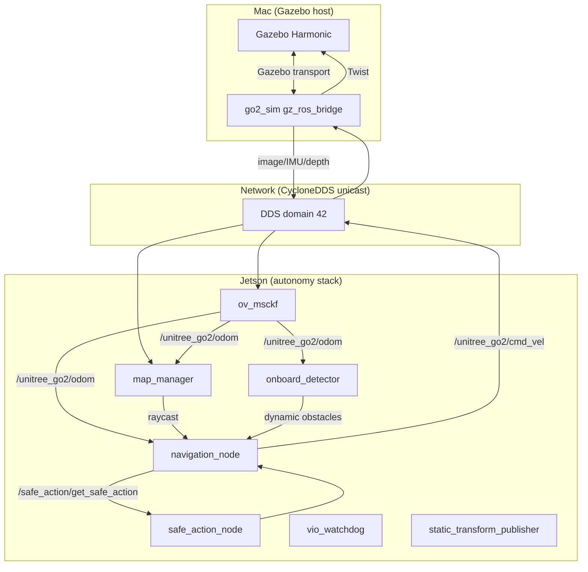
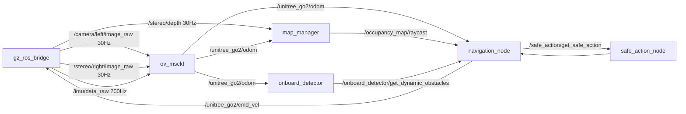

# System Architecture

## Overview

This project is a stereo visual-inertial odometry (VIO) and autonomous navigation stack for a legged/wheeled robot (Unitree Go2-like). It runs primarily on an NVIDIA Jetson, with an optional hybrid simulation where Gazebo Harmonic runs on a Mac and the autonomy stack remains on the Jetson.

## Hardware components

| Component | Role | Notes |
|---|---|---|
| NVIDIA Jetson | Autonomy computer | Runs ROS 2 Humble, OpenVINS, map_manager, navigation |
| 2× CSI IMX219 cameras | Stereo vision | Left/right pair, ~61 mm baseline |
| ICM-20948 | IMU | 200 Hz, I2C, used by OpenVINS |
| MacBook Air | Simulation host | Optional, runs Gazebo + gz_ros_bridge |

## Software stack

## ROS 2 topic graph (simulation mode)

## Coordinate frames

- `map`: world-fixed frame used by RViz, map_manager, navigation_node.
- `global`: OpenVINS world frame. An identity `map -> global` static TF bridges the two.
- `imu`: IMU/body frame, published by OpenVINS.
- `cam0`, `cam1`: left/right camera frames, child of `imu` via calibration TF.
- `left_camera_link`, `right_camera_link`, `imu_link`, `depth_camera_link`: simulator link names.

## Package responsibilities

| Package | Responsibility |
|---|---|
| `stereo_depth_ros2` | Stereo capture, rectification, SGBM depth, launch orchestration, VIO watchdog |
| `ov_msckf` (OpenVINS) | Stereo-inertial odometry |
| `map_manager` | Occupancy voxel/2D map, raycast service |
| `onboard_detector` | Dynamic obstacle detection |
| `navigation_runner` | RL-based navigation policy + safe-action checking |
| `icm20948_ros2` | IMU driver |
| `perception_viz` | Sensor visualization (legacy MiDaS pipeline) |
| `midas_trt_nvargus` | Monocular depth via TensorRT (legacy/not active) |
| `go2_sim` (Mac only) | Gazebo world, robot model, gz_ros_bridge |

See [NETWORK_DDS_SETUP.md](NETWORK_DDS_SETUP.md), [SIMULATION_SETUP.md](SIMULATION_SETUP.md), [VIO_INTEGRATION.md](VIO_INTEGRATION.md), and [NAVIGATION_STACK.md](NAVIGATION_STACK.md) for details.
