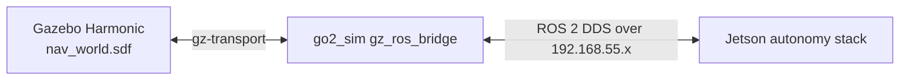

# Hybrid Simulation Setup

The simulator lets you validate VIO and navigation without hardware. Gazebo Harmonic runs natively on macOS; the autonomy stack runs on the Jetson.

## Architecture



## Mac side

### Prerequisites

- ROS 2 Humble built from source (`/Users/pranav/personal/indiflo/sim/ros2_humble`)
- Gazebo Harmonic (`gz sim 8.14.0`)
- `go2_sim` package (`~/gz_sim_ws`)
- `setup_env.sh` bash environment

### Start the simulator

```bash
bash
source /Users/pranav/personal/indiflo/sim/setup_env.sh
ros2 launch go2_sim sim_world.launch.py gui:=false
```

Use `gui:=true` only if you want the Gazebo GUI on the Mac desktop.

### Verified Mac topics

```bash
ros2 topic list
ros2 topic hz /camera/left/image_raw
ros2 topic hz /imu/data_raw
```

## Jetson side

```bash
source /workspaces/ros2_ws/scripts/setup_jetson_sim_env.sh
ros2 launch stereo_depth_ros2 stereo_vio_navigation_sim.launch.py
```

This launches OpenVINS, map_manager, dynamic_detector, safe_action_node, navigation_node, vio_watchdog, and the `map -> global` static TF. It does **not** start `stereo_depth_node` or `icm20948_node` because cameras/IMU come from the simulator.

## Topic contract

### Mac → Jetson

| Topic | Type | Frame | Rate | Notes |
|---|---|---|---|---|
| `/camera/left/image_raw` | `sensor_msgs/Image` | `left_camera_link` | 30 Hz | RGB `rgb8`, 640×480 |
| `/stereo/right/image_raw` | `sensor_msgs/Image` | `right_camera_link` | 30 Hz | RGB `rgb8`, 640×480 |
| `/stereo/depth` | `sensor_msgs/Image` | `depth_camera_link` | 30 Hz | 320×240 |
| `/imu/data_raw` | `sensor_msgs/Imu` | `imu_link` | 200 Hz | covariances zero |

### Jetson → Mac

| Topic | Type | Notes |
|---|---|---|
| `/unitree_go2/cmd_vel` | `geometry_msgs/Twist` | DiffDrive plugin consumes this |

## Coordinate frames in simulation

All sensor links are fixed to `base_link`:

- `base_link`: robot center, z = 0.1 m above ground
- `left_camera_link`: `(0.15, 0, 0.05)`
- `right_camera_link`: `(0.15, -0.06097, 0.05)` (61 mm baseline)
- `imu_link`: `(0.15, 0, 0.05)` (coincident with left camera)
- `depth_camera_link`: `(0.15, 0, 0.05)`

Wheel radius 0.05 m, wheel separation 0.24 m.

## Jetson simulator config differences

Because the simulated sensors are collocated and upright, the simulator configs differ from the real robot:

| Config | Real robot | Simulator |
|---|---|---|
| `config/openvins_sim/cam_chain.yaml` | `T_imu_cam` = 180° z-rotation | `T_imu_cam` = identity |
| `cfg/map_param_sim.yaml` | body-to-depth transform from calibration | identity |
| launch | `stereo_vio_navigation.launch.py` | `stereo_vio_navigation_sim.launch.py` |

## Verifying end-to-end

```bash
# On Jetson
ros2 topic list | grep -E 'camera/left|stereo/right|imu/data_raw|stereo/depth|cmd_vel|odom'
ros2 topic hz /camera/left/image_raw
ros2 topic hz /imu/data_raw
ros2 topic info -v /camera/left/image_raw   # should show BEST_EFFORT
```

Send a test command:

```bash
ros2 topic pub /unitree_go2/cmd_vel geometry_msgs/msg/Twist "{linear: {x: 0.2}, angular: {z: 0.0}}"
```

The robot should move in Gazebo.

See [NETWORK_DDS_SETUP.md](NETWORK_DDS_SETUP.md) for DDS details and [OPERATION.md](OPERATION.md) for running navigation goals.
